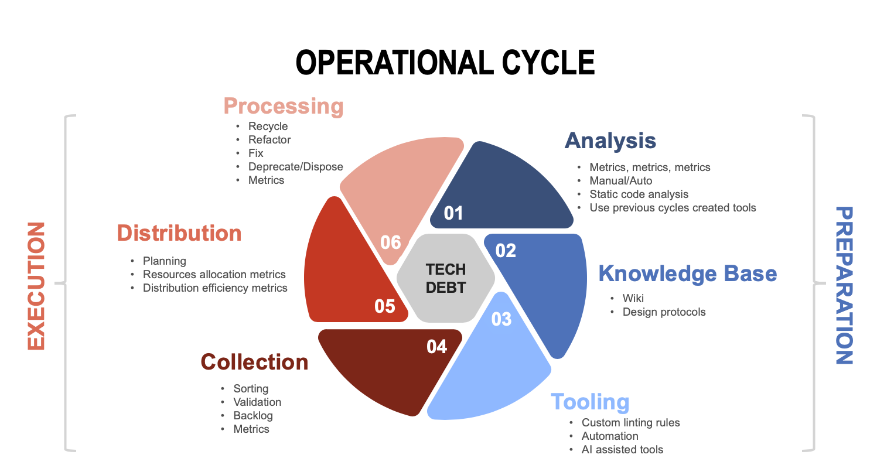
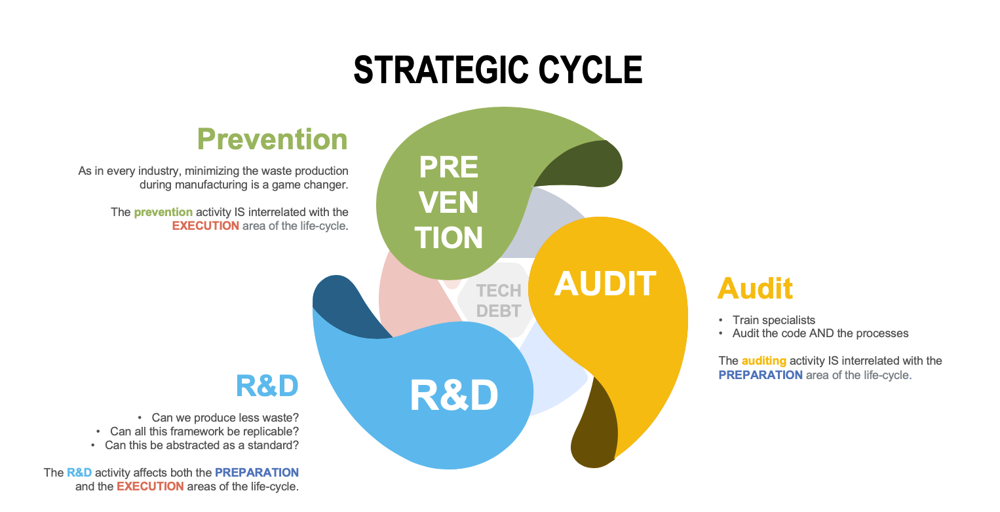

# TECH-DEBT AS WASTE MANAGEMENT IN SOFTWARE INDUSTRY

– Let's talk about **TECH-DEBT**  
– That thing again? **WHY?!**  

Do you find yourself in this conversation? (－‸ლ) **EXACTLY!**  

*Photo by [Sebastian Herrmann](https://unsplash.com/photos/jzTQVxCyKYs) on [Unsplash](https://unsplash.com/)*

Unfortunately, we tend to adapt to discomfort and, without finding a solution to a chronic pain, we end up ignoring the ringing alarm for good.  

I've seen this repeating pattern many times in my career, especially when dealing with TECH-DEBT, so I started working backwards trying to understand why this is still an issue; after so many years.

Let's start with some history first.

## The "discovery"

It's hard to talk in terms of "world wide software industry" before the early 90's if we consider "industry" as a production system for a large [consumer base](https://en.wikipedia.org/wiki/Customer_base) (**Microsoft Windows** was released on [November, 1985](https://en.wikipedia.org/wiki/Microsoft#1985%E2%80%931994:_Windows_and_Office) and **Classic Mac OS** in [January, 1984](https://en.wikipedia.org/wiki/Classic_Mac_OS)) but still, at that time, a lot of amazing high-level programming languages like COBOL or Fortran were already there––for decades––and many genius minds were around and thinking how to make things better; and they already had a clear understanding of the consequences of producing **"not-quite-right-code"**.

## The Metaphor

In 1992 the outstanding [Ward Cunningham](https://en.wikipedia.org/wiki/Ward_Cunningham) used the analogy of a financial [debt](http://c2.com/doc/oopsla92.html) to refer to that **"not-quite-right-code"** (you can see [his 5' video](https://www.youtube.com/watch?v=pqeJFYwnkjE) too)

## The adoption

It took some time, but, by the first decade of the 21st century the whole software engineering community adopted the term, the metaphor and the idea behind the words, building different strategies and protocols around the **debt-acquisition** and **debt-payment** dynamics. But yet, we're still here talking about that; frustrated and uncomfortable with the whole thing. **THERE is were I stopped and detected a glitch**.

## The Mind Glitch

The metaphor was adopted at a great cost, **simply because we're all biased when it comes to financial debt**, the "debt" **signifier** is quiet innocuous but the **signified** is a dark universe! ([signifier/signified](https://en.wikipedia.org/wiki/Course_in_General_Linguistics))

1. Being in debt is something we avoid
2. Owing money is scary
3. Making a client owe money feels WRONG
4. We shouldn’t be leaking our client’s pocket
5. Hiding a small money leak is easy until it isn’t, but it might be somebody else's problem by then. (pass–the–buck factor)
6. No one wants to pay for somebody else’s debts!

And it wasn't Cunningham's fault, it was ours, we, individually, introduced the signified bug and covered the **"not-quite-right-code"** thing with such a negative aura that it makes us struggle to think clearly on the problem.

## The Mind Shift

The first thing I do when I feel lost is to calm down and look around to find some reference points. Going back to the "manufacturing", "industry" and "not-quite-right-thing" we can find some "intersections".

*Photo by [Alexander Andrews](https://unsplash.com/photos/c91LS-JK7cw) on [Unsplash](https://unsplash.com/)*

Every industry produces "not-quite-right-stuff" along with "the-right-stuff" and the term is **industrial waste**; it can be environmentally friendly, recyclable, sellable, lightly toxic or extremely poisonous and radioactive but they all generate some kind of sub-product during the manufacturing process and they all had to learn to deal with it, in most cases regulated by law.  

*Photo by [Michal Pech](https://unsplash.com/photos/xS5bOLKCSLw) on [Unsplash](https://unsplash.com/)*

At this point it becomes crystal clear that **the natural sub-product of the software industry IS TECH-DEBT**.  

The [TTM](https://en.wikipedia.org/wiki/Time_to_market) has mutated from a per-year basis to a per-sprint one; the technology also evolves at a thrilling pace, all this means that we're producing an incredible amount of waste. Blame the market, the managers, FOMO related to tech trends, but even if I produce the best code today, tomorrow it might be legacy/incorrect/deprecated and that's just for the green field; we're not even including existing legacy code in the equation.

Our work permeates almost everything around us, from the most trivial mobile app and up to medical devices, transportation and aerospace industries; this is a huge responsibility, so being systematic and thoughtful on how we prepare our work to be easy to maintain and fix, will make the difference between a bad day and a life.

## The Plan

So now what? We detected a glitch but what can we do about it?  

**BE INTENTIONAL**  

By intentional I mean to do something about it every day through a strict plan. The plan is defined by **9 sustainment principles** which are both **independent** and **interrelated**.

- **Operational Cycle**
  - Preparation
    - [1. Analysis](#1-analysis)
    - [2. Knowledge Base](#2-knowledge-base)
    - [3. Tooling](#3-tooling)
  - Execution
    - [4. Collection](#4-collection)
    - [5. Distribution](#5-distribution)
    - [6. Processing](#6-processing)
- **Strategic Cycle**
  - Leading
    - [7. Prevention](#7-prevention)
    - [8. Audit](#8-audit)
    - [9. R&D](#9-rd)

### Preparation

Every output here should be designed to iteratively improve the [execution](#execution) group.

#### 1. Analysis

**Code Analysis** can be done manually, through developer tools or through automated tools, but all existing code––old or new––should be analyzed. An iterative process must be defined and followed by every team and the output captured in a backlog.

**Metrics** will be highly affected by the development process and the technologies involved, but metrics are the key to understand the big picture in many ways, e.g.––at a high level––if you divide `(total commits / bug-fix commits) * 100` you'll obtain a defect commit rate percentage. Many insightful numbers can be obtained through metrics, but of course, to have metrics you have to generate them somehow. If you're not sure about what to measure, just start measuring something, the ideas may come together with the numbers.

#### 2. Knowledge Base

There's no point for Analysis if it's not captured in a knowledge base, **a project MUST have a wiki**.

Unless captured at company level, **design and write down protocols** for common tasks in a concise way, too many or too few rules will tend to produce more mistakes during execution.

#### 3. Tooling

The result of analysis and knowledge base should **produce some kind of tooling**. These tools can be designed to assist stepin 1 and 2 or to assist in step 4. Be intentional on investing time and resources to build  hight quality tools for the "manufacturing" process.

### Execution

Every output here should be designed to iteratively plan and manufacture the product.

#### 4. Collection

All insights produced during preparation **should be collected, sorted, validated and organized in a backlog**. An empty or inexistent tech-debt backlog is a big sign of waste accumulation.

Organize your backlog as an **intentional data-oriented source of information**, you'll have to see the numbers to make better decisions on each step of the cycle.

#### 5. Distribution

Here's where your **sprint/quarter planning** shines, you have the analysis, the protocols, the tools and the material; plan around it all, allocate time and resources and distribute the work, pursuing constant improvement instead of instant perfection.

**Generate and use metrics** for this so to share the tech-debt processing tasks in a sustainable way for your people and your business. This shouldn't create tension or burn out anybody but it has to be constantly captured as part of the daily work of a team.

#### 6. Processing

And here's where **all the previous work collapses into a concrete code** action by being recycled––if useful for other purposes––refactored, fixed, deprecated or disposed, and **annotations get added for the next cycle**.

Also here, **metrics** can be extremely useful. How much code needed to be refactored, fixed or deprecated? Why? Was it old or a recently created code?

### Leading

[Preparation](#preparation) and [Execution](#execution) groups tend to be incremental, linear and continuous; **leading** is meant to be **exponential**. If a jump is possible we'll see it here.

#### 7. Prevention

As in every industry, minimizing waste production during manufacturing is a game changer. The prevention principle is **interrelated** with the [Execution](#execution) area of the life-cycle.

#### 8. Audit

- Train specialists
- Audit the code AND the processes
- Get metrics

The auditing activity is **interrelated** with the [Preparation](#preparation) area of the life-cycle.

#### 9. R&D

- Can we produce less waste?
- Can all this framework be replicable?
- Can this be abstracted as a standard?
- Can we design general purpose tools for all our projects?
- Can we productize something?

The R&D activity affects both the [Preparation](#preparation) and the [Execution](#execution) areas of the life-cycle.

## TL;DR

- Tech-debt is not a bad thing "per se", **the bad thing is the "un" factor**
  - Un-known
  - Un-wanted
  - Un-tracked
  - Un-intentional
  - Un-planned
  - Un-handled
- **Bug fixing and security are commonly related to tech-debt** but that's **not a ["sine qua non"](https://en.wikipedia.org/wiki/Sine_qua_non) condition**. Having separated backlogs or tags for bug fixing, security and technical debt is a good idea and the more data-oriented and granular the backlog is, the easier to analyzing the data will be.
- **The plan can be applied retrospectively** with great benefits, start analyzing, tagging and organizing your old backlog thinking about tech-debt and crunch some numbers; you'll be surprised.

### Closing notes

A lot of work is still required, each principle should be refined along with the concrete tasks, but the high level definition is clear.  
